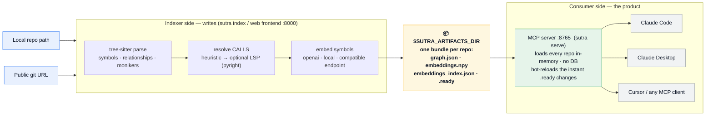
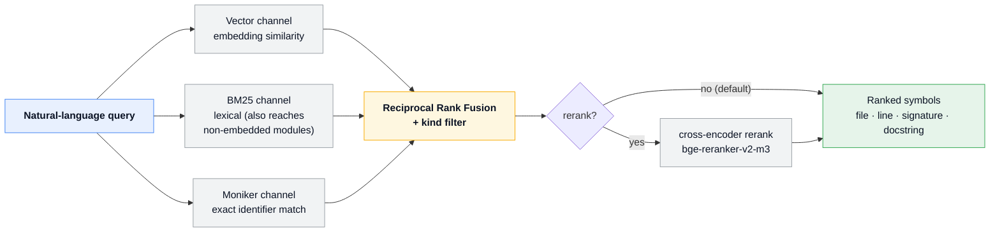

# Sutra

**Code-aware retrieval for your repositories.** Sutra parses a Git repo into a
structured graph of symbols + relationships + embeddings, then serves it over
an **MCP server** that an AI agent (Claude Code, Claude Desktop, Cursor, …)
queries as a RAG over your codebase — "which function handles auth?", "who
calls `upload_voice_note`?", "show me the `Meeting` model".

The defining principle is **pure code-based analysis with zero LLM enrichment
in indexing**: the graph + embeddings are rich enough that a downstream agent
understands the repo without anything being pre-summarized.

---

## Contents

- [Mental model: two sides](#mental-model-two-sides)
- [Prerequisites](#prerequisites)
- [Install](#install)
- [Configuration](#configuration)
- [Quick start (the 3 surfaces)](#quick-start-the-3-surfaces)
  - [1. Web frontend (easiest)](#1-web-frontend-easiest)
  - [2. CLI indexer](#2-cli-indexer)
  - [3. MCP server (the product)](#3-mcp-server-the-product)
- [Connecting an agent](#connecting-an-agent)
- [The MCP tools](#the-mcp-tools)
- [Key concepts](#key-concepts)
- [What Sutra does and does not do](#what-sutra-does-and-does-not-do)
- [Project layout](#project-layout)
- [Testing](#testing)
- [Troubleshooting](#troubleshooting)
- [Roadmap](#roadmap)

---

## Mental model: two sides

Sutra is **two programs that meet through files on disk**, not one app. The
shape is a **bowtie**: many sources *fan in* through the indexer to one central
artifacts directory (the knot), which *fans out* to every consumer agent. That
directory is the entire contract between the two sides.



> Remote teammates connect their MCP clients over **HTTP + bearer token** to
> `:8765`; browsers hit the indexing UI at `:8000`.

- **Indexer** (`pipelines.full_index`, wrapped by the web frontend): clones a
  repo, parses it, resolves calls, embeds, and writes a **per-repo artifact
  bundle** to `$SUTRA_ARTIFACTS_DIR/<owner__repo>/`.
- **Consumer** (`sutra serve`, a.k.a. `python -m sutra.mcp`): loads that
  directory **entirely into memory** and serves it. **No database at query
  time** — `pip install` + a folder of artifacts is the whole deployment. It **hot-reloads** a repo the
  moment its `.ready` sentinel changes, so re-indexing is picked up live.

The two share one local directory, `$SUTRA_ARTIFACTS_DIR` (default
`~/.sutra/artifacts`). That directory is the entire contract between them.

---

## Prerequisites

> `sutra init` (see [Install](#install)) detects and provisions all of these
> for you — this list is what it configures.

- **Python 3.11** (3.11.14 is the tested version) and a virtualenv.
- **Node.js + npm** — only to build the web frontend.
- **pyright** — required for LSP-grade call resolution, which the frontend uses
  by default (`pip install pyright`). The frontend refuses to start without it.
- **An embedder** — one of:
  - **OpenAI** (default config): set `OPENAI_API_KEY`. Network required.
  - **local** (sentence-transformers, offline): install the ML extras below.
  - **fixture** (deterministic fake vectors): no key, used for tests/demos.
- **PostgreSQL is NOT required.** The MVP runs JSON-only; Postgres only returns
  if/when incremental indexing is added (see [Roadmap](#roadmap)).

---

## Install

Sutra is a pip-installable package with a `sutra` console command. Create a
Python 3.11 venv, install it, then run the guided setup wizard:

```bash
git clone <your sutra remote> && cd sutra
python3.11 -m venv .venv && source .venv/bin/activate

pip install -e .        # editable install from a clone (use `pip install .` for a plain install)

sutra init              # guided setup wizard — configures everything below
```

`sutra init` is interactive and idempotent (re-run it any time; it offers your
current values as defaults). Each step is skippable, shows the exact command
before running anything, and writes config only at the end. It guides you
through:

- **Embedder choice** — local sentence-transformers (`all-MiniLM-L6-v2`, free /
  offline), OpenAI (`text-embedding-3-small`, needs `OPENAI_API_KEY`), or any
  **OpenAI-compatible endpoint** (Ollama, LM Studio, vLLM, Together, Azure, …)
  via a `base_url`. For local it does the correct **CPU-only torch** two-step
  install so pip doesn't pull the ~5GB CUDA build.
- **Artifacts directory** — where indexed repos land (`SUTRA_ARTIFACTS_DIR`,
  default `~/.sutra/artifacts`).
- **Postgres (optional)** — only enables incremental re-indexing bookkeeping;
  Sutra runs fully JSON-only without it.
- **Resolver / pyright** — installs `pyright` for LSP-grade call resolution (the
  frontend/UI default).
- **MCP registration (optional)** — registers the server with Claude Code, or
  prints a JSON snippet for other MCP clients.

Then re-validate your environment any time with:

```bash
sutra doctor            # non-interactive ✓/✗ checks + fix hints
```

Build the web frontend (only if you'll use the UI):

```bash
make ui-install   # cd frontend/web && npm install
make ui-build     # cd frontend/web && npm run build
```

<details>
<summary><b>Advanced / still-supported:</b> manual install without the wizard</summary>

The pre-wizard flow keeps working — install dependencies and hand-edit
`config/sutra.yaml` yourself:

```bash
pip install -r requirements.txt

# Required for --resolver lsp (the frontend default):
pip install pyright

# OPTIONAL — only for the local embedder or the cross-encoder reranker.
# Install CPU-only torch FIRST or pip pulls the ~5GB CUDA build:
pip install torch --index-url https://download.pytorch.org/whl/cpu
pip install -r requirements-ml.txt
```

</details>

---

## Configuration

**`config/sutra.yaml`** — chooses the embedder:

```yaml
embedder:
  provider: openai          # openai | local | fixture
  model: text-embedding-3-small
  dimensions: 1536
  batch_size: 100
  api_key_env: OPENAI_API_KEY
  # local-only:
  # model: all-MiniLM-L6-v2
  # dimensions: 384
```

**Environment variables**

| Variable | Used by | Meaning |
|---|---|---|
| `SUTRA_ARTIFACTS_DIR` | frontend, MCP server | Where per-repo artifacts live (default `~/.sutra/artifacts`). Both sides must point at the same dir. |
| `OPENAI_API_KEY` | indexer (and MCP server, if artifacts were embedded with OpenAI) | Required when `provider: openai`. |
| `SUTRA_MCP_TOKEN` | MCP server | Bearer token required on every HTTP request (unset = no auth). |

> The embedding model is recorded in each artifact. The MCP server rebuilds the
> *same* model at query time from that metadata — so an OpenAI-embedded repo
> needs `OPENAI_API_KEY` on the query side too; a `local`-embedded repo needs
> the ML extras; a `fixture` repo needs nothing.

---

## Quick start (the 3 surfaces)

Once `sutra init` has configured your environment, these are the everyday
commands:

```bash
sutra index <path-or-url>   # index a repo (local path or a git URL)
sutra serve                 # run the MCP server (the product)
sutra ui                    # launch the web frontend on :8000
sutra doctor                # re-validate the environment (✓/✗ + fix hints)
```

Each wraps an existing entrypoint (`sutra index` → `pipelines.full_index`,
`sutra serve` → `python -m sutra.mcp`, `sutra ui` → uvicorn on
`frontend.api.main:app`). The three surfaces below show each in full, with the
underlying `python -m …` invocation documented as the still-supported advanced
path.

### 1. Web frontend (easiest)

A single-port local app: FastAPI API + a job queue + live SSE logs, with the
React UI served as static files.

```bash
source .venv/bin/activate
export SUTRA_ARTIFACTS_DIR=~/.sutra/artifacts     # where indexed repos land
export OPENAI_API_KEY=sk-...                       # if config uses openai

sutra ui                                            # serves on :8000
# open http://127.0.0.1:8000
```

> Advanced / still-supported: `make ui-run` (or
> `uvicorn frontend.api.main:app --host 127.0.0.1 --port 8000`) does the same thing.

In the UI: paste a **public** Git URL, choose "Replace existing index", click
**Start Indexing**, and watch the logs stream. When it finishes you'll see
symbol/file counts, the embedding model, token usage and estimated cost, and
download links for the raw artifacts. The indexed repo is now live in any MCP
server pointed at the same `$SUTRA_ARTIFACTS_DIR`.

What the frontend does under the hood, per job: `git clone` → run
`pipelines.full_index --replace --resolver lsp` writing to
`$SUTRA_ARTIFACTS_DIR/<owner__repo>/` → delete the clone (structure-only). It
runs **JSON-only** (no Postgres) and one job at a time.

> Private repos (username + PAT) are **not yet supported** in the UI — public
> URLs only for now. See [Roadmap](#roadmap).

### 2. CLI indexer

The same indexing the frontend wraps, run directly. The simplest form takes a
local path or a git URL:

```bash
source .venv/bin/activate
sutra index /path/to/your-repo                        # a repo already on disk
sutra index https://github.com/org/your-repo          # or clone + index a URL
```

<details>
<summary><b>Advanced / still-supported:</b> the underlying <code>python -m pipelines.full_index</code></summary>

`sutra index` wraps `pipelines.full_index`. To drive it directly with full
control over resolver, output dir, and re-index mode:

```bash
source .venv/bin/activate
python -m pipelines.full_index \
    --root /path/to/your-repo \
    --repo-url https://github.com/org/your-repo \
    --output-dir "$SUTRA_ARTIFACTS_DIR/org__your-repo" \
    --config config/sutra.yaml \
    --resolver lsp \
    --replace
```

| Flag | Meaning |
|---|---|
| `--root` | Local path to the repo to index (read-only; not cloned). |
| `--repo-url` | Canonical remote URL — its `owner/repo` becomes the repo's identity. |
| `--output-dir` | Where to write the artifact bundle. Use `$SUTRA_ARTIFACTS_DIR/<owner__repo>` so the MCP server finds it. |
| `--config` | Path to `sutra.yaml` (default `config/sutra.yaml`). |
| `--resolver` | `lsp` (pyright type inference, best, Python) → `heuristic` (default; local/import/unique rules, all langs) → `none`. |
| `--replace` | Re-index: overwrite this repo's artifact in place (the normal mode). |
| `--pg-url` | Optional Postgres URL for incremental bookkeeping; **omit for JSON-only** (the supported MVP path). |

</details>

Output: `graph.json` + `embeddings.npy` + `embeddings_index.json`, committed
atomically with a `.ready` sentinel written last.

### 3. MCP server (the product)

Point it at the artifacts directory and it serves every repo inside. With the
package installed, `sutra serve` runs it from anywhere — it wraps
`python -m sutra.mcp` and takes the same flags.

> **Two things that trip people up — read before you run it:**
> 1. **OpenAI-embedded artifacts need `OPENAI_API_KEY` at *query* time too.**
>    The server re-embeds your *query* with the same model the repo was indexed
>    with. Without the key that repo is **skipped** (you'll see
>    `skipping <repo>: … set OPENAI_API_KEY`, then `No loadable artifacts`).
>    Export the key, or re-index that repo with `provider: local` / `fixture`
>    in `config/sutra.yaml` for key-free querying.
> 2. **For another machine to connect you need BOTH `--host 0.0.0.0` and
>    `SUTRA_MCP_TOKEN`.** The default `--host` is `127.0.0.1` (this machine
>    only). On a `0.0.0.0` bind the bearer token is the *only* thing guarding
>    your code — **never expose `0.0.0.0` without a token.**

```bash
source .venv/bin/activate
export SUTRA_ARTIFACTS_DIR=~/.sutra/artifacts
export OPENAI_API_KEY=sk-...                          # if any artifact is OpenAI-embedded

# Local stdio — for an agent on THIS machine:
sutra serve --artifacts-dir "$SUTRA_ARTIFACTS_DIR"

# Shared team server over HTTP (for other machines) — token REQUIRED:
export SUTRA_MCP_TOKEN=$(openssl rand -hex 32); echo "$SUTRA_MCP_TOKEN"
sutra serve --artifacts-dir "$SUTRA_ARTIFACTS_DIR" --http --host 0.0.0.0 --port 8765
# endpoint: http://<your-LAN-IP>:8765/mcp   (find your IP with: hostname -I)
```

> Advanced / still-supported: `python -m sutra.mcp …` (same flags) works too.
> When invoking it directly rather than via the `sutra` command, run it from the
> repo root with the repo's `.venv` active (or set `PYTHONPATH=/path/to/sutra`)
> so `sutra`/`mcp` are importable — `ModuleNotFoundError: No module named
> 'sutra'` / `'mcp'` means you got that wrong.

| Flag / env | Meaning |
|---|---|
| `--artifacts-dir` / `SUTRA_ARTIFACTS_DIR` | Root holding one artifact subdir per repo. |
| `--http` `--host` `--port` | Streamable-HTTP transport instead of stdio (default port 8765). |
| `SUTRA_MCP_TOKEN` | Bearer token required on every HTTP request (unset = no auth). |
| `--no-watch` | Disable `.ready` hot-reload. |
| `--audit-db` | SQLite audit log path (default `~/.sutra/mcp_audit.db`); every tool call is recorded. |

At boot the server validates every artifact (schema version, torn-artifact
cross-checks, embedding-model identity) and **skips bad ones individually** —
one broken repo never takes the server down.

**Smoke-test it** without wiring an agent — spawns the real server over stdio
and walks every tool:

```bash
python scripts/verify_mcp.py --artifacts-dir "$SUTRA_ARTIFACTS_DIR" \
    --query "which function creates a user" --repo org/your-repo
```

---

## Connecting an agent

### Claude Code — same machine (stdio)

`sutra init` offers to register the server for you (wizard step 6). To do it by
hand, point Claude at the **absolute `sutra` console script** in your venv and an
**absolute** artifacts path (`~` is not expanded when the command is exec'd):

```bash
claude mcp add sutra -s user \
  -e OPENAI_API_KEY=sk-...                          # omit for local/fixture artifacts \
  -- /path/to/sutra/.venv/bin/sutra serve \
     --artifacts-dir /home/you/.sutra/artifacts
```

- `-s user` registers it for every project (default scope is per-directory `local`).
- Already added a broken one? `claude mcp remove sutra` first (from the dir you added it in).
- `/mcp` failing with `-32000` means the spawned server died — see [Troubleshooting](#troubleshooting).

<details>
<summary><b>Advanced / still-supported:</b> registering the raw <code>python -m sutra.mcp</code></summary>

A bare `claude mcp add sutra -- python -m sutra.mcp …` **will fail** — Claude
spawns the server from *its* working directory (not the repo) with whatever
`python` is on PATH, so it can't import `sutra`/`mcp`. If you skip the console
script, pin the **absolute venv python** and pass the repo on `PYTHONPATH`:

```bash
claude mcp add sutra -s user \
  -e PYTHONPATH=/path/to/sutra \
  -e OPENAI_API_KEY=sk-...                          # omit for local/fixture artifacts \
  -- /path/to/sutra/.venv/bin/python -m sutra.mcp \
     --artifacts-dir /home/you/.sutra/artifacts
```

</details>

### Claude Code — another machine on your LAN (HTTP, recommended for sharing)

Start the **HTTP** server on the host (see [§3](#3-mcp-server-the-product)) with
`--host 0.0.0.0` **and** a `SUTRA_MCP_TOKEN`, then on the *other* machine
register the host's **LAN IP** (run `hostname -I` on the host) with the same
token:

```bash
# on the CLIENT machine:
claude mcp add --transport http sutra -s user http://<HOST-LAN-IP>:8765/mcp \
  --header "Authorization: Bearer <the SUTRA_MCP_TOKEN printed by the host>"
```

HTTP avoids every stdio pitfall (cwd, interpreter, env) — the server runs in a
shell you control; clients just hit a URL. For the client to reach it: the host
must bind `0.0.0.0`, the host firewall must allow the port
(`sudo ufw allow 8765/tcp`), and the Wi-Fi must not isolate clients (common on
guest/corporate networks — home Wi-Fi is usually fine).

### Claude Desktop / Cursor (`claude_desktop_config.json` / `.cursor/mcp.json`)

Same rule as stdio above — use the **absolute `sutra` console script** in your
venv and absolute paths:

```json
{
  "mcpServers": {
    "sutra": {
      "command": "/abs/path/sutra/.venv/bin/sutra",
      "args": ["serve", "--artifacts-dir", "/home/you/.sutra/artifacts"],
      "env": {
        "OPENAI_API_KEY": "sk-..."
      }
    }
  }
}
```

> Advanced / still-supported: the raw form is
> `"command": "/abs/path/sutra/.venv/bin/python"`,
> `"args": ["-m", "sutra.mcp", "--artifacts-dir", "…"]` with
> `"PYTHONPATH": "/abs/path/sutra"` added to `env`.

---

## The MCP tools

| Tool | Arguments | Returns |
|---|---|---|
| `sutra_list_repos` | — | indexed repos + symbol counts + commit SHAs + embedding model |
| `sutra_search` | `query`, `repo?`, `top_k=10`, `rerank=False` | ranked symbols with file/line, signature, docstring, per-channel provenance |
| `sutra_get_symbol` | `moniker` | full metadata for one symbol + its callers/callees |
| `sutra_get_callers` | `moniker` | symbols with a resolved CALLS edge into it |
| `sutra_get_callees` | `moniker` | symbols it calls |
| `sutra_expand_neighbors` | `moniker`, `depth=1`, `kinds?` | BFS over the relationship graph (calls/extends/implements/references/contains/imports) |

**Agent workflow:** `sutra_search` to find an entry point → `sutra_get_symbol`
/ `sutra_get_callers` / `sutra_expand_neighbors` to walk the call/type graph
outward. Pass `repo="owner/repo"` to scope to one repo, or omit it to search
across all indexed repos.

Each `sutra_search` is itself a **butterfly**: the query fans out across three
independent retrieval channels, then fans back in through Reciprocal Rank Fusion
into one ranked list — all in memory:



`rerank=True` adds a cross-encoder pass (`BAAI/bge-reranker-v2-m3`) — **~60s+
per query on CPU**; leave it off unless you're on GPU.

See **`MCP_USAGE.md`** for the full tool reference and hot-reload/sync details.

---

## Key concepts

- **Moniker (symbol identity)** — every symbol gets a stable SCIP-style id:
  `sutra <language> <owner/repo> <file_path> <descriptor>`. The `owner/repo`
  is baked in, so the same function name in two different repos never collides.
- **Repo identity** — derived once, canonically, from the URL:
  `https://github.com/Acme/Widget` → `acme/widget` (lowercased, host-stripped).
  The artifact folder is the filesystem-safe slug `acme__widget`. Two repos
  named `widget` from different owners coexist cleanly.
- **Artifact bundle** — per repo: `graph.json` (symbols, relationships, files,
  metadata), `embeddings.npy` (one row per embeddable symbol), and
  `embeddings_index.json` (row ↔ moniker). A `.ready` sentinel is written
  **last** and is the commit point the MCP watcher fires on.
- **Resolvers** — turn unresolved CALLS into real edges. `heuristic`
  (local/import/unique rules, all languages, no types) → optionally chained
  with `lsp` (pyright type inference for Python, resolves what the heuristic
  can't). LSP runs at index time, against the clone, before it's deleted.
- **Retrieval channels** — `sutra_search` fuses three: **vector** (embedding
  similarity), **BM25** (lexical, also reaches modules that aren't embedded),
  and **moniker** (exact identifier match), combined with Reciprocal Rank
  Fusion. Everything is in-memory.
- **Languages** — Python, TypeScript, Go (tree-sitter).

---

## What Sutra does and does not do

**Does**
- Index Python / TypeScript / Go repos into a queryable symbol + call graph.
- Resolve **intra-repo** calls (heuristic ~92% on real repos; LSP pushes Python
  toward ~99%).
- Serve many repos from one in-memory MCP server; trace call chains within a
  repo via `get_callers` / `get_callees` / `expand_neighbors`.

**Does not (by design / current scope)**
- **No cross-repo or cross-service call resolution.** Microservices talk over
  HTTP/RPC, not source-level function calls, so there are no AST edges to
  resolve between them. "Token flow across the whole app" stops at repo
  boundaries — the agent bridges services by *searching*, not by graph edges.
- **No dataflow / taint analysis.** "How does the token flow" is approximated
  by walking the call graph + reading signatures/docstrings, not by tracking a
  variable through parameters.
- **Structure-only at query time.** Clones are deleted after indexing; the
  agent gets symbols, signatures, docstrings, and call edges — not raw source
  bytes. (It can open files itself if it has the repo checked out.)
- **JSON-only MVP** — no Postgres, no incremental indexing yet; re-index a repo
  to refresh it.

---

## Project layout

```
sutra/
├── core/
│   ├── extractor/        tree-sitter parsing → symbols/relationships; monikers
│   │   └── adapters/     python.py · typescript.py · go.py
│   ├── resolver/         CALLS resolution: heuristic.py, lsp_resolver.py (pyright)
│   ├── embedder/         openai · local (sentence-transformers) · fixture + factory
│   ├── retrieval/        channels (vector/bm25/moniker), fusion, reranker, pipeline
│   ├── graph/            SQL writer/reader (indexer-side), rustworkx traversal (query-side)
│   ├── artifact/         AtomicArtifactWriter (.ready), loader, ArtifactSink
│   ├── output/           json_graph_exporter.py (the bundle serializer)
│   ├── vector_store/     in-memory vector index
│   └── indexer.py        orchestrates a full index → publishes the artifact
├── mcp/                  server.py (6 tools), registry, watcher, audit, __main__.py
pipelines/
├── full_index.py         CLI entry point for indexing
└── incremental_update.py (deferred path; needs Postgres)
frontend/
├── api/                  FastAPI: job queue, SSE logs, SQLite job db (main.py, jobs.py)
└── web/                  React + Vite UI
config/sutra.yaml         embedder configuration
scripts/verify_mcp.py     spawn the real MCP server over stdio and exercise every tool
docs/superpowers/         design specs & implementation plans
tests/                    pytest suite (real instances, no mocks); fixtures/
```

Further reading: **`DESIGN.md`** (architecture & data model — note it predates
the JSON-only/owner-identity changes in places), **`MCP_USAGE.md`** (MCP
deployment & tools), **`ENV.md`** (environment specifics).

---

## Testing

Real instances, real artifacts, real subprocesses — **no mocks**.

```bash
source .venv/bin/activate
python -m pytest -q -k "not pgvector and not sql"   # the JSON-only suite (~700 tests)
```

The `pgvector`/`sql` tests need a live Postgres and are outside the JSON-only
MVP. Adapters, indexer, exporter, resolvers, retrieval, and the MCP
loader/server/watcher all have dedicated tests; `tests/fixtures/` holds a small
checked-in Python repo used for hermetic end-to-end runs.

---

## Troubleshooting

| Symptom | Cause / fix |
|---|---|
| Frontend won't start: "pyright-langserver not found" | `pip install pyright` — LSP is the frontend's default resolver. |
| Frontend won't start: "OPENAI_API_KEY is required" | Config uses `provider: openai`. Set the key, or switch to `local`/`fixture` in `config/sutra.yaml`. |
| MCP server: `ModuleNotFoundError: No module named 'sutra'` (or `'mcp'`) | Wrong cwd or interpreter. Run from the repo root with its `.venv` active, **or** use the absolute `…/sutra/.venv/bin/python` and set `PYTHONPATH=/path/to/sutra`. |
| MCP server prints `skipping <repo>: … set OPENAI_API_KEY` then exits `No loadable artifacts` | The repo is **present but skipped**, not missing — it was OpenAI-embedded, so the server needs `OPENAI_API_KEY` to embed queries with the same model. Export the key used to index it, or re-index with a `local`/`fixture` embedder. |
| MCP server: `No loadable artifacts` and the dir is empty/wrong | `--artifacts-dir` must hold *subdirectories*, one per repo, each with `graph.json` + `embeddings.npy` + `embeddings_index.json`. Index something first. |
| Agent: `Failed to reconnect: -32000` | The stdio server died on launch. Reproduce the exact spawn from a neutral dir; usual causes: wrong cwd/venv (→ absolute python + `PYTHONPATH`), missing `OPENAI_API_KEY`, or a literal `~` in `--artifacts-dir` (use an absolute path). |
| Remote client: connection refused / hangs | Server bound to `127.0.0.1`. Restart with `--host 0.0.0.0`. Then verify the IP (`hostname -I`), host firewall (`sudo ufw allow 8765/tcp`), and Wi-Fi client isolation. |
| Remote client: `421 Misdirected Request` / "Invalid Host header" | Old build — update to a version where the HTTP team server relaxes the SDK's localhost-only Host allowlist (the bearer token is the auth boundary). |
| Remote client: `401 unauthorized` | Missing/wrong `Authorization: Bearer <token>` — it must equal the server's `SUTRA_MCP_TOKEN`. |
| MCP server: "Embedding model mismatch" | The artifact was embedded with a model the query side can't build. For OpenAI artifacts set `OPENAI_API_KEY`; for local artifacts install the ML extras. |
| "Torn artifact: …" | A half-written/half-copied bundle. Re-index; when syncing remotely, copy data files first and the `.ready` sentinel **last**. |
| First query is slow | sentence-transformers / reranker models load lazily on first use, then cache. |
| Indexed repo not showing up in the agent | Frontend and MCP server must share the same `$SUTRA_ARTIFACTS_DIR`, and the server needs `.ready` (written automatically by indexing). |

---

## Roadmap

1. **Private-repo support in the frontend** — public/private toggle, username +
   PAT (held in memory only, never logged or persisted, scrubbed from the log
   stream).
2. **Incremental indexing** — re-index only changed files via `git diff`
   (re-introduces Postgres for bookkeeping).
3. **Cross-service awareness** (later) — HTTP route ↔ client-call matching so an
   agent can follow flows across microservices, which call resolution can't.
